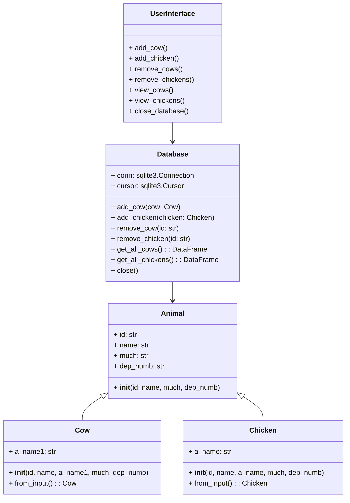

```mermaid
classDiagram
    class Animal {
        + id: str
        + name: str
        + much: str
        + dep_numb: str
        + __init__(id, name, much, dep_numb)
    }

    class Cow {
        + a_name1: str
        + __init__(id, name, a_name1, much, dep_numb)
        + from_input() : Cow
    }

    class Chicken {
        + a_name: str
        + __init__(id, name, a_name, much, dep_numb)
        + from_input() : Chicken
    }

    class Database {
        + conn: sqlite3.Connection
        + cursor: sqlite3.Cursor
        + add_cow(cow: Cow)
        + add_chicken(chicken: Chicken)
        + remove_cow(id: str)
        + remove_chicken(id: str)
        + get_all_cows() : DataFrame
        + get_all_chickens() : DataFrame
        + close()
    }

    class UserInterface {
        + add_cow()
        + add_chicken()
        + remove_cows()
        + remove_chickens()
        + view_cows()
        + view_chickens()
        + close_database()
    }


    Animal <|-- Cow
    Animal <|-- Chicken
    UserInterface --> Database
    Database --> Animal
```
